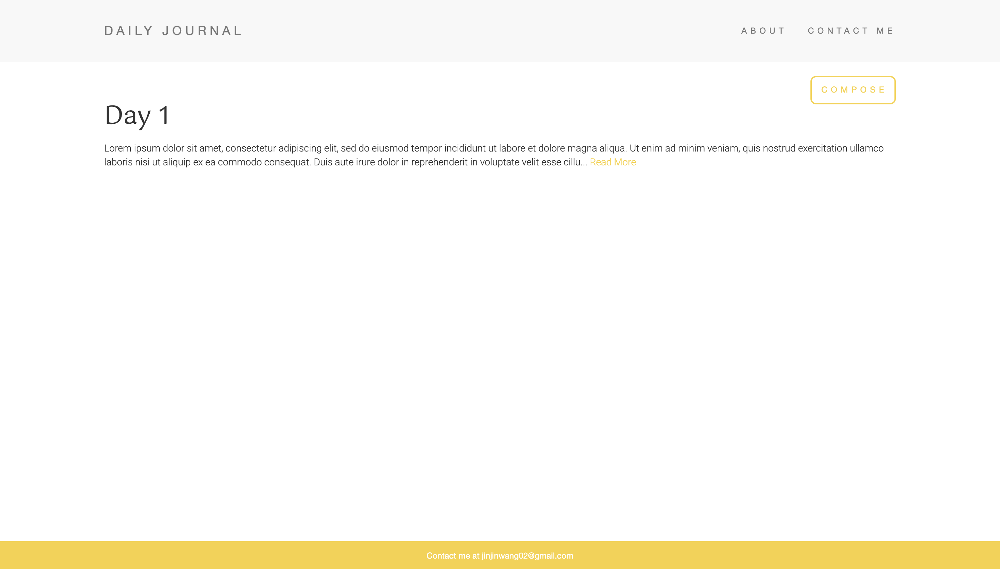
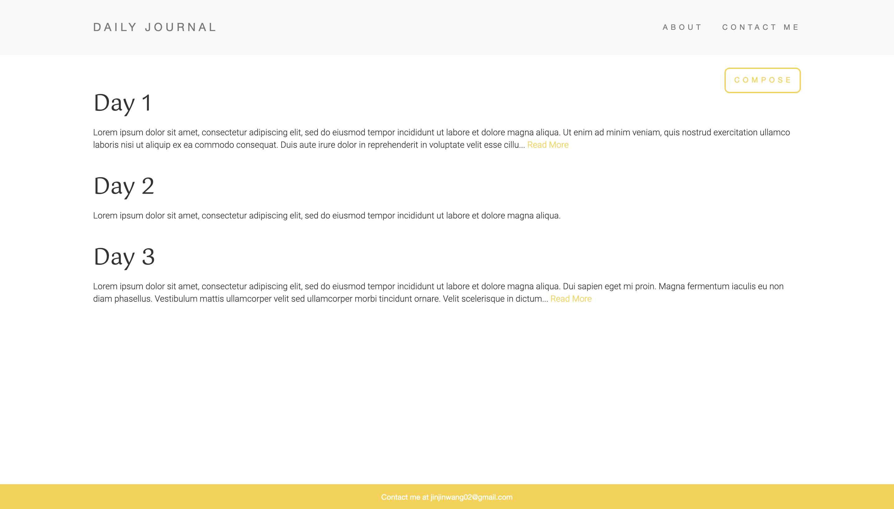

# Welcome to daily-journal

A simple blog built using node js. Heavily inspired by https://www.udemy.com/course/the-complete-web-development-bootcamp/





## Install

```bash
# install requirements
npm install
npm i express
npm i body-parser
npm i ejs
npm i lodash
```
## Run server

```bash
# run app
node app.js
```

## Open app

Your app will now be accessible at localhost:3000

## Author

👤 **Jinjin Wang**

* Github: [@lyrisswing](https://github.com/lyrisswing)
